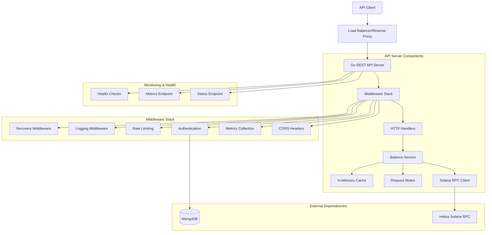
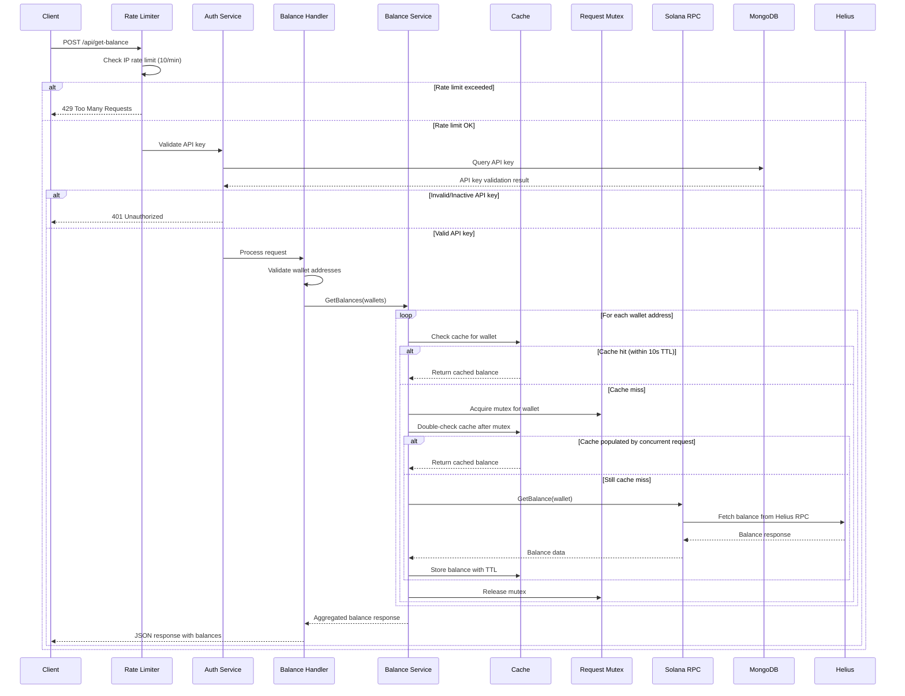
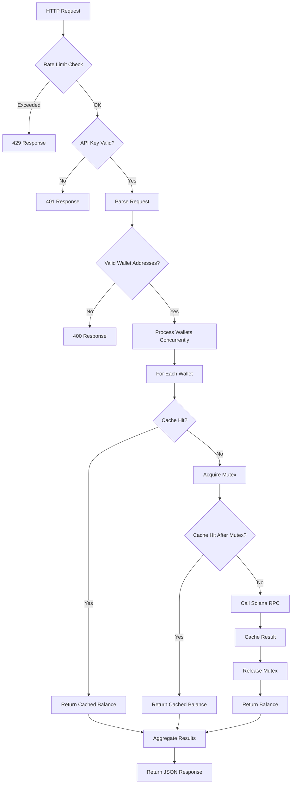
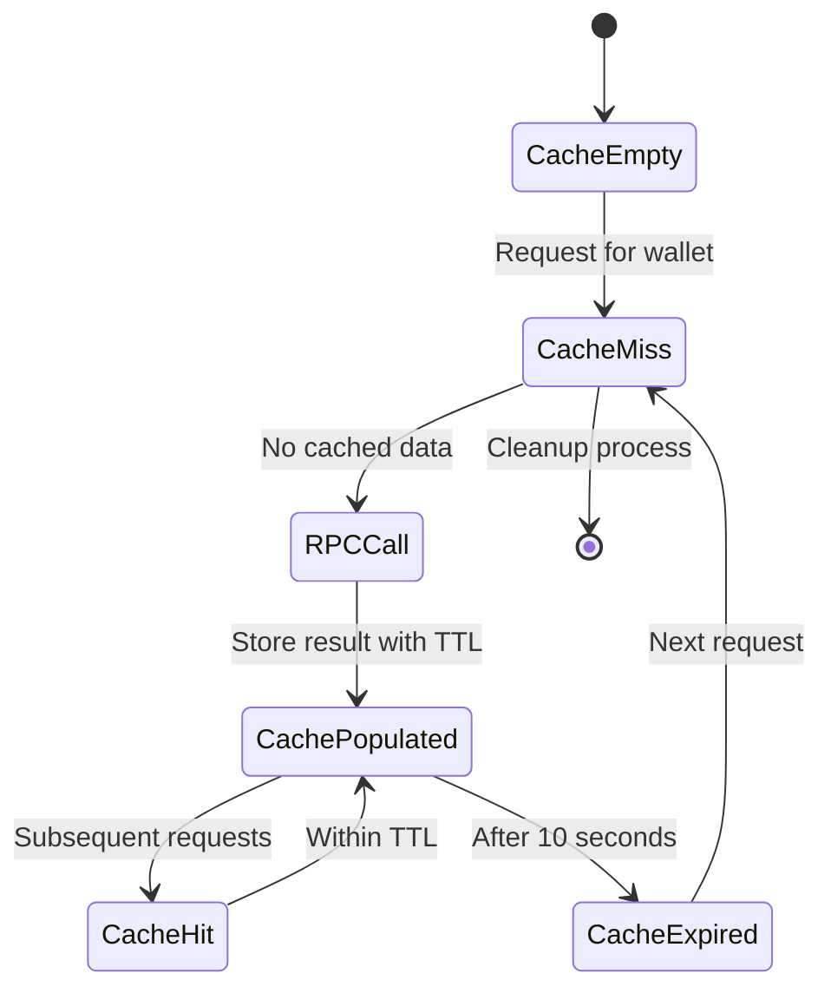

# Solana Balance API - Complete Architecture & Workflow Documentation

## Overview

The Solana Balance API is a high-performance, production-ready REST service built in Go that provides authenticated access to Solana wallet balances. The system integrates with Helius RPC, implements MongoDB-based authentication, includes IP rate limiting, and uses intelligent caching with mutex-based concurrency control to optimize performance.

## Project Structure

```
solana-balance-api/
├── cmd/
│   └── server/           # Application entrypoint
│       └── main.go
├── internal/
│   ├── config/           # Configuration management
│   ├── handlers/         # HTTP request handlers
│   ├── middleware/       # HTTP middleware (auth, rate limiting, etc.)
│   ├── models/           # Data models and structs
│   └── services/         # Business logic services
├── pkg/
│   ├── cache/            # Caching utilities
│   └── ratelimiter/      # Rate limiting utilities
├── .env.example          # Environment variables template
├── go.mod                # Go module definition
├── go.sum                # Go module checksums
└── README.md             # This file
```

## Dependencies

- **Gin**: HTTP web framework
- **MongoDB Driver**: Database connectivity
- **Solana-Go**: Solana blockchain integration
- **GoDotEnv**: Environment variable management

## Configuration

Copy `.env.example` to `.env` and adjust the values as needed:

```bash
cp .env.example .env
```

## Running the Application

```bash
go run cmd/server/main.go
```

## Features

- MongoDB-based API key authentication
- IP-based rate limiting (10 requests per minute)
- In-memory caching with 10-second TTL
- Concurrent request deduplication
- Helius Solana RPC integration
- High-performance HTTP server with Gin

## API Endpoints

- `POST /api/get-balance` - Fetch balance for one or multiple Solana wallets

## Development

This project follows Go best practices with a clean architecture:

- `cmd/` - Application entry points
- `internal/` - Private application code
- `pkg/` - Public library code that can be imported by other projects

## System Architecture

### High-Level Architecture Diagram



### Detailed Request Flow Diagram



## Component Architecture

### 1. HTTP Server Layer

**Location**: `cmd/server/main.go`

The main server orchestrates all components and handles:
- Server initialization and configuration
- Middleware stack setup
- Route configuration
- Graceful shutdown
- Background cleanup routines

**Key Features**:
- Optimized HTTP server configuration
- Connection pooling and keep-alive
- Request timeout management
- Health monitoring integration

### 2. Middleware Stack

The middleware stack processes requests in the following order:

#### Recovery Middleware
- Catches panics and converts them to HTTP 500 errors
- Provides structured error logging

#### Logging Middleware
- Structured logging with correlation IDs
- Request/response logging
- Performance metrics collection

#### Rate Limiting Middleware
**Location**: `pkg/ratelimiter/`
- IP-based rate limiting (10 requests per minute)
- Sliding window implementation
- Proper HTTP headers (X-RateLimit-*)
- Memory-efficient cleanup

#### Authentication Middleware
**Location**: `internal/middleware/auth.go`
- API key validation against MongoDB
- Support for Bearer token format
- Context enrichment with user information

#### Metrics Middleware
- Performance monitoring
- Request counting and timing
- Cache hit/miss tracking

### 3. HTTP Handlers

**Location**: `internal/handlers/balance.go`

Handles the main API endpoint:
- Request validation and parsing
- Wallet address format validation
- Response formatting
- Error handling and status codes

### 4. Balance Service

**Location**: `internal/services/balance.go`

Core business logic that orchestrates:
- Cache management
- Concurrent request handling
- RPC client integration
- Performance metrics collection

**Key Features**:
- Concurrent processing of multiple wallets
- Request deduplication using mutexes
- Cache-first strategy with TTL
- Comprehensive error handling

### 5. Caching System

**Location**: `pkg/cache/cache.go`

Thread-safe in-memory cache with:
- 10-second TTL per wallet address
- Automatic cleanup of expired entries
- RWMutex for concurrent access
- Memory leak prevention

### 6. Request Mutex System

**Location**: `pkg/mutex/mutex.go`

Per-address mutex system that:
- Prevents duplicate concurrent RPC calls
- Uses address-specific mutexes
- Automatic cleanup of unused mutexes
- Memory-efficient implementation

### 7. Solana RPC Client

**Location**: `internal/services/solana.go`

Integrates with Helius Solana RPC:
- Uses gagliardetto/solana-go library
- Retry logic with exponential backoff
- Batch processing for multiple addresses
- Health check capabilities
- Proper error handling and timeouts

### 8. Authentication Service

**Location**: `internal/services/auth.go`

MongoDB-based authentication:
- API key validation and management
- Connection pooling optimization
- Index management for performance
- Proper error categorization

### 9. Configuration Management

**Location**: `internal/config/config.go`

Environment-based configuration:
- Server settings (timeouts, ports)
- Database configuration
- RPC client settings
- Cache and rate limit parameters
- Logging configuration

## Data Flow Architecture

### Request Processing Flow



### Cache Management Flow



## Performance Optimizations

### 1. Concurrent Processing
- Multiple wallet addresses processed in parallel
- Goroutine-based concurrent execution
- Wait groups for synchronization

### 2. Request Deduplication
- Per-address mutexes prevent duplicate RPC calls
- Cache-after-mutex pattern ensures consistency
- Memory-efficient mutex management

### 3. Connection Pooling
- MongoDB connection pooling with optimized settings
- HTTP client reuse with keep-alive connections
- Configurable pool sizes and timeouts

### 4. Caching Strategy
- In-memory cache with 10-second TTL
- Thread-safe operations with RWMutex
- Automatic cleanup prevents memory leaks

### 5. Resource Management
- Graceful shutdown handling
- Background cleanup routines
- Memory-efficient data structures

## Security Features

### 1. Authentication
- MongoDB-stored API keys
- Secure key validation
- Support for active/inactive keys
- Bearer token format support

### 2. Rate Limiting
- IP-based request limiting
- Sliding window implementation
- Proper HTTP status codes and headers
- DDoS protection

### 3. Input Validation
- Solana address format validation
- Request size limits
- JSON schema validation
- SQL injection prevention

### 4. Error Handling
- Structured error responses
- No sensitive information leakage
- Proper HTTP status codes
- Comprehensive logging

## Monitoring and Observability

### 1. Health Checks
- Database connectivity monitoring
- RPC endpoint health verification
- Component status reporting
- Detailed health information

### 2. Metrics Collection
- Request counting and timing
- Cache hit/miss ratios
- RPC call statistics
- Error rate monitoring

### 3. Structured Logging
- Correlation ID tracking
- Performance metrics logging
- Error tracking and alerting
- Security event logging

### 4. Performance Monitoring
- Response time tracking
- Throughput measurement
- Resource utilization monitoring
- Bottleneck identification

## Deployment Architecture

### Environment Configuration

The system supports multiple deployment environments through environment variables:

```bash
# Server Configuration
SERVER_PORT=8080
SERVER_HOST=0.0.0.0
SERVER_READ_TIMEOUT=10s
SERVER_WRITE_TIMEOUT=10s
SERVER_IDLE_TIMEOUT=60s

# MongoDB Configuration
MONGODB_URI=mongodb://localhost:27017
MONGODB_DATABASE=solana_api
MONGODB_APIKEY_COLLECTION=api_keys
MONGODB_MAX_POOL_SIZE=100

# Solana RPC Configuration
SOLANA_RPC_ENDPOINT=https://pomaded-lithotomies-xfbhnqagbt-dedicated.helius-rpc.com/?api-key=37ba4475-8fa3-4491-875f-758894981943
SOLANA_RPC_TIMEOUT=30s
SOLANA_RPC_MAX_RETRIES=3

# Cache Configuration
CACHE_TTL=10s
CACHE_CLEANUP_INTERVAL=60s

# Rate Limiting Configuration
RATE_LIMIT_REQUESTS_PER_MINUTE=10
RATE_LIMIT_WINDOW_SIZE=1m

# Logging Configuration
LOG_LEVEL=info
LOG_ENVIRONMENT=production
```

### Scalability Considerations

1. **Horizontal Scaling**: Stateless design allows multiple instances
2. **Load Balancing**: Support for reverse proxy and load balancers
3. **Database Scaling**: MongoDB replica sets and sharding support
4. **Cache Scaling**: Redis integration possible for distributed caching
5. **Monitoring**: Prometheus metrics integration ready

## Error Handling Strategy

### Error Categories

1. **Authentication Errors (401)**
   - Missing API key
   - Invalid API key
   - Inactive API key

2. **Rate Limiting Errors (429)**
   - Too many requests from IP
   - Proper retry-after headers

3. **Validation Errors (400)**
   - Invalid wallet address format
   - Empty wallet array
   - Malformed JSON

4. **RPC Errors (502)**
   - Helius RPC unavailable
   - Network timeout
   - Invalid RPC response

5. **Internal Errors (500)**
   - Database connection issues
   - Cache failures
   - Unexpected system errors

### Error Response Format

```json
{
  "error": {
    "code": "ERROR_CODE",
    "message": "Human readable message",
    "details": "Additional context"
  },
  "timestamp": "2024-08-16T07:30:20Z"
}
```

## Testing Strategy

The system includes comprehensive testing at multiple levels:

### 1. Unit Tests
- Individual component testing
- Mock-based isolation
- Edge case coverage

### 2. Integration Tests
- End-to-end API testing
- Database integration testing
- RPC client testing

### 3. Performance Tests
- Load testing scenarios
- Concurrent request handling
- Cache performance validation

### 4. Security Tests
- Authentication bypass attempts
- Rate limiting validation
- Input validation testing

This architecture provides a robust, scalable, and maintainable solution for Solana balance querying with enterprise-grade features and performance optimizations.